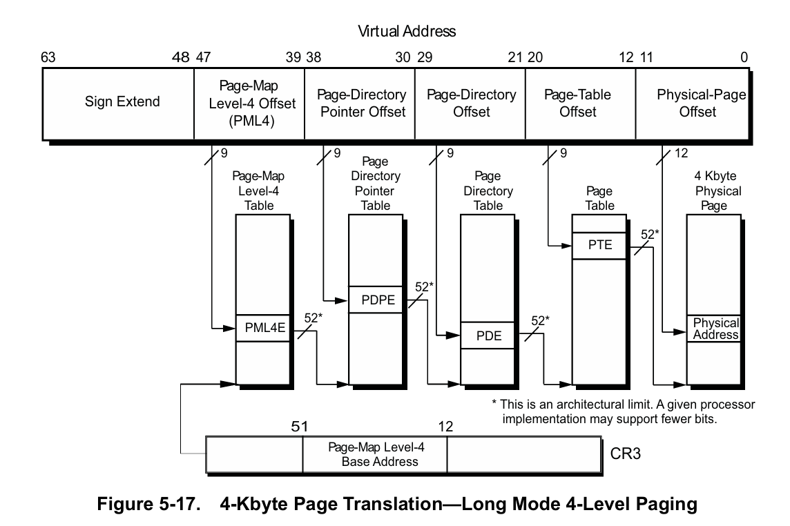
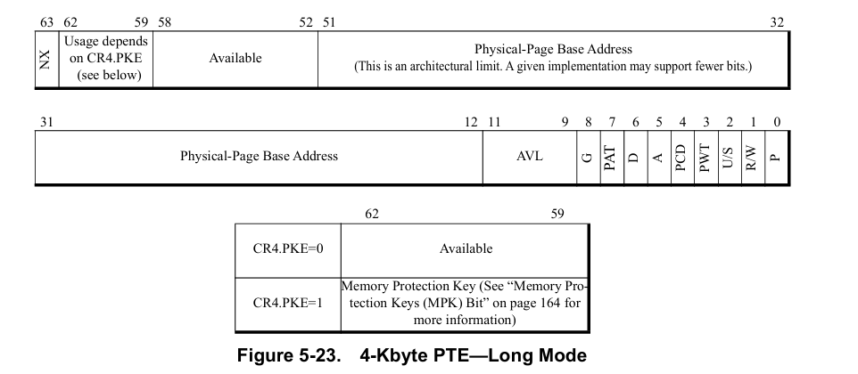

# R/W memory without Mmcopy & attach

利用分頁機制切換 page frame number 並刷新 TLB 來讀寫物理記憶體。

已實現 IOCTL 之溝通，可以自行替換。

Kernel Function 的 Offset 需自行替換 (MmAllocateIndependentPages, MiGetPteAddress)

目前預設為:
- MmAllocateIndependentPages (ntoskrnl + 0xfd590)
- MiGetPteAddress (ntoskrnl + 0xBA9F8)

主要是因為懶得寫特徵去 call 下面也會講要怎麼找 offset。
## DEMO

## 實現細節

此讀寫方式實現原理為先利用 MmAllocateIndependentPages 創建頁表 (為了不生成大頁表`PDE`) 且設為 `PTE` 的最大值。

然後再去尋找要讀取的 process 當中的虛擬地址，並將他轉成物理地址。
```c=
ULONG64 TransformationCR3(UINT32 Index, ULONG64 cr3, ULONG64 VirtualAddress)
{
    cr3 &= ~0xf;
    ULONG64 PAGE_OFFSET = VirtualAddress & ~(~0ul << 12);
    SIZE_T BytesTransferred = 0;
    ULONG64 a = 0, b = 0, c = 0;
    ReadPhysicalAddress(Index, (cr3 + 8 * ((VirtualAddress >> 39) & (0x1ffll))), &a, sizeof(a)); // 讀 PDPE
    if (~a & 1)
    {
        return 0;
    }
    ReadPhysicalAddress(Index, ((a & ((~0xfull << 8) & 0xfffffffffull)) + 8 *
        ((VirtualAddress >> 30) & (0x1ffll))), &b, sizeof(b)); // 讀 PDE
    if (~b & 1)
    {
        return 0;
    }
    if (b & 0x80)
    {
        return (b & (~0ull << 42 >> 12)) + (VirtualAddress & ~(~0ull << 30));
    }
    ReadPhysicalAddress(Index, ((b & ((~0xfull << 8) & 0xfffffffffull)) + 8 *
        ((VirtualAddress >> 21) & (0x1ffll))), &c, sizeof(c)); // 讀 PTE
    if (~c & 1)
    {
        return 0;
    }
    if (c & 0x80)
    {
        return (c & ((~0xfull << 8) & 0xfffffffffull)) + (VirtualAddress & ~(~0ull <<
            21));
    }
    ULONG64 address = 0;
    ReadPhysicalAddress(Index, ((c & ((~0xfull << 8) & 0xfffffffffull)) + 8 *
        ((VirtualAddress >> 12) & (0x1ffll))), &address, sizeof(address)); // 讀物理地址
    address &= ((~0xfull << 8) & 0xfffffffffull);
    if (!address)
    {
        return 0;
    }
    return address + PAGE_OFFSET;
}
```
藉由上述函數即可將 process 對應的虛擬地址轉換出來，

而由於需要 cr3 因此也需要獲取 PEPROCESS 結構才能夠得到 cr3，

PEPROCESS 的 DTB 其實就是 Cr3，

Cr3 的 offset 網路上都搜尋的到 這邊是 0x28。


取得物理地址以後所需要的就剩讀取了。
```c=
VOID ReadPhysicalAddress(UINT32 Index, ULONG64 phy, PVOID buffer, SIZE_T size)
{
    PageTable* page = &List[Index];
    page->Pte->PageFrameNumber = phy >> PAGE_SHIFT;
    //DbgPrint("Physical Address: 0x%x\n", phy);
    __invlpg(page->VirtualAddress);
    __movsb((PUCHAR)buffer, (PUCHAR)page->VirtualAddress + (phy & 0xFFF), size);
    page->Pte->PageFrameNumber = page->OldPageFrameNumber;
    __invlpg(page->VirtualAddress);
}
```
可以看到首先獲取 page 以後將他的 pfn 改成物理地址的 pfn，

修改之後刷新 TLB 讓修改生效就能夠取得記憶體當中的數值了，

而寫入只需要將 `__movsb` 的值相反就能實現了。

## 問題
需要避免兩個問題
multiprocessor 以及跨頁讀取
> 當中可能有 Cache 問題，不確定寫入 CacheDisable 跟 WriteThrough 能不能解決，不知道怎麼測試。

1. multiprocessor
由於 multiprocessor 可能會導致同時獲取同一個 page 因此需要多開幾個 page 來解決，並且透過KeGetCurrentProcessorIndex 來分配 page 這樣才能保證每個 processor 不會獲取到同一個 page。
2. 跨頁讀取
如果說讀寫記憶體時超過了 0xFFF 便會跨頁，那這個問題也很簡單，你沒辦法一次讀超過兩個頁表的內容就讀兩次，當超出範圍時就切到能讀的最大值然後再去讀下一段就好了 。

## 找 ntoskrnl offset
找 offset 很簡單

把 ntoskrnl.exe 從系統裡面拉出來丟 IDA

因為 ntoskrnl 用 IDA 開啟可以自動載入 PDB 因此很方便就能找出想要使用的 Function 位址


或是其實也可以利用 windbg 然後搜尋該 function 也能獲取 offset
## Reference
此專案為 https://bbs.kanxue.com/thread-279103.htm 此篇的概念實現。
並參考 lyshark https://www.lyshark.com/post/19fe1026.html 此篇之 cr3 虛擬地址轉物理地址。
